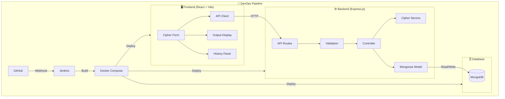

# 🔐 Cipher Converter

A production-ready full-stack web application for encrypting and decrypting text using classical and modern ciphers, with a complete DevOps pipeline.


---

## 📌 Features

- **Multiple Cipher Support**: Caesar, Vigenère, Base64, AES-256
- **Real-time Processing**: Instant encrypt/decrypt results
- **Conversion History**: Stored in MongoDB, viewable in the UI
- **Dark Cyberpunk UI**: Glassmorphism, animated particles, neon accents
- **Fully Containerized**: Docker Compose with 3 services
- **CI/CD Pipeline**: Jenkins declarative pipeline
- **Responsive Design**: Mobile-first, works on all devices

---

## 🏗️ Architecture



---

## 📁 Project Structure

```
cipher-converter/
├── client/                  # React frontend (Vite)
│   ├── src/
│   │   ├── api/             # API client (Axios)
│   │   ├── components/      # React components
│   │   ├── utils/           # Constants & helpers
│   │   ├── App.jsx          # Root component
│   │   └── index.css        # Design system & styles
│   ├── Dockerfile           # Multi-stage: Node build → Nginx
│   └── nginx.conf           # SPA routing + API proxy
│
├── server/                  # Express backend
│   ├── config/              # Database configuration
│   ├── controllers/         # Request handlers
│   ├── middleware/           # Validation & error handling
│   ├── models/              # Mongoose schemas
│   ├── routes/              # API route definitions
│   ├── services/            # Cipher algorithm implementations
│   ├── __tests__/           # Jest unit tests
│   ├── Dockerfile           # Node Alpine with health check
│   └── index.js             # Express entry point
│
├── docker-compose.yml       # 3-service orchestration
├── Jenkinsfile              # CI/CD pipeline
├── .env.example             # Environment variable template
└── README.md                # This file
```

---

## 🚀 Quick Start

### Prerequisites

- **Node.js** 18+
- **Docker Desktop** (for containerized deployment)
- **MongoDB** (local, or use Docker)

### Local Development

```bash
# 1. Clone the repository
git clone https://github.com/your-username/cipher-converter.git
cd cipher-converter

# 2. Create environment file
cp .env.example .env

# 3. Install dependencies
npm run install:all

# 4. Start the backend (requires MongoDB running)
npm run dev:server

# 5. Start the frontend (in a new terminal)
npm run dev:client
```

- **Frontend**: http://localhost:5173
- **Backend API**: http://localhost:5000/api
- **Health Check**: http://localhost:5000/api/health

### Docker Deployment

```bash
# Build and start all services
docker-compose up --build

# The app will be available at:
# Frontend: http://localhost
# Backend:  http://localhost:5000
```

---

## 📡 API Reference

### `POST /api/encrypt`

Encrypt text using the specified cipher.

```json
// Request Body
{
  "text": "Hello World",
  "cipherType": "caesar",
  "key": "3"
}

// Response
{
  "success": true,
  "result": "Khoor Zruog",
  "operation": "encrypt",
  "cipherType": "caesar"
}
```

### `POST /api/decrypt`

Decrypt text using the specified cipher.

```json
// Request Body
{
  "text": "Khoor Zruog",
  "cipherType": "caesar",
  "key": "3"
}

// Response
{
  "success": true,
  "result": "Hello World",
  "operation": "decrypt",
  "cipherType": "caesar"
}
```

### `GET /api/history?page=1&limit=20`

Fetch paginated conversion history.

### `DELETE /api/history`

Clear all conversion history.

---

## 🔐 Supported Ciphers

| Cipher | Type | Key Required | Description |
|--------|------|-------------|-------------|
| **Caesar** | Classical | Shift (number) | Shifts each letter by N positions |
| **Vigenère** | Classical | Keyword (text) | Polyalphabetic substitution cipher |
| **Base64** | Encoding | None | Standard Base64 encode/decode |
| **AES** | Modern | Secret key | AES-256 symmetric encryption |

---

## 🧪 Testing

```bash
# Run backend unit tests
cd server && npm test
```

Tests cover:
- All cipher encrypt/decrypt roundtrips
- Edge cases (empty input, special characters, unicode)
- API integration tests

---

## 🐳 Docker Services

| Service | Port | Description |
|---------|------|-------------|
| `client` | 80 | React app served by Nginx |
| `server` | 5000 | Express.js API |
| `mongo` | 27017 | MongoDB database |

---

## 🔁 CI/CD Pipeline (Jenkins)

The `Jenkinsfile` defines a 5-stage pipeline:

1. **Clone Repository** — Checkout from GitHub
2. **Install Dependencies** — Parallel install for client & server
3. **Run Tests** — Execute Jest test suite
4. **Build Docker Images** — Build all containers
5. **Deploy Containers** — Start services with docker-compose

### Setup

1. Install Jenkins and Docker on your CI server
2. Create a pipeline job pointing to this repo's `Jenkinsfile`
3. Add `aes-secret-key` credential in Jenkins
4. Configure GitHub webhook for automatic triggers

---

## 🛠️ Environment Variables

| Variable | Default | Description |
|----------|---------|-------------|
| `PORT` | 5000 | Backend server port |
| `NODE_ENV` | development | Environment mode |
| `MONGO_URI` | mongodb://localhost:27017/cipher-converter | MongoDB connection string |
| `AES_SECRET_KEY` | — | Secret key for AES encryption |
| `CLIENT_URL` | http://localhost:5173 | Frontend URL for CORS |

---

## 📄 License

MIT License — See [LICENSE](LICENSE) for details.

---

**Built with ❤️ using React, Express, MongoDB, Docker & Jenkins**
